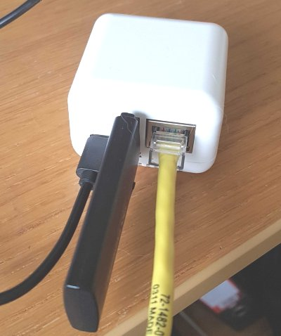

Title: Using the Neo3 as a wiperf Probe
Authors: Nigel Bowden

# Using the Neo3 as a wiperf Probe

<span style="font-size: small; color:gray">*28th January 2021 - Author: Nigel Bowden*</span>

Although I tend to recommend running wiperf on either a WLAN Pi or A Raspberry Pi, there is no reason you can't try running it up on other Linux-based small board computers.

One of my favourite SBCs is the [Neo3  from Friendly Elec](https://www.friendlyarm.com/index.php?route=product/product&path=69&product_id=279){target=_blank}. It's a very compact, high performance unit. The only downside it has is that it does not have a wireless NIC if you wish to test over wireless. To fix this, you can use a Comfast CF-912AC USB adapter, which will give you a reasonably good 802.11ac, 2 stream connection.

In this article, I'll run through the basic build process to get you going with wiperf using a Neo3 kit. To perform this build, you'll need:

- [NanoPi Neo3-LTS](https://www.friendlyarm.com/index.php?route=product/product&path=69&product_id=279) (Select combo with case when purchasing)
- A 16Gb or better Micro SD card
- A [CF-912AC USB wireless NIC](https://www.amazon.com/Comfast-CF-912AC-1200MBPS-Realtek-Network/dp/B01KX1M436/){target=_blank} (checkout eBay & Aliexpress for other sources)
- Some kind of power source. The Neo3 needs a Type-C power connection (I use a phone charger with a USB-A to Type-C cable - the power requirements are quite low)
- A USB to micro-SD adapter to burn the image (for example: [an adapter like this](https://www.amazon.com/Vanja-Adapter-Portable-Memory-Reader/dp/B00W02VHM6){target=_blank}
- A copy of [balenaEtcher](https://www.balena.io/etcher/){target_blank} (free) to burn the image on to your SD card



Here are the steps I followed to build wiperf on  Neo3:

1. Go to the image download page for the Neo3 on the Armbian site:

    https://www.armbian.com/nanopineo3/

2. Select the "Armbian Buster" direct download link.

3. Burn the image on to an SD card (16G or better recommended) using balenaEtcher (https://www.balena.io/etcher/){target=_blank}

4. Once the image is burned on to the SD card, put the SD card in to the Neo3 and power it on

5. Plug the Neo3 in to an Ethernet port so that it can get an IP address (You will likely need to look on your DHCP server or switch MAC/ARP table to figure out the IP address assigned. The default hostname you may see listed on your DCP server is `nanopineo3`). The Ethernet port used will also need Internet access to allow package downloads.

6. Once you have the IP address of the Neo3, SSH to it and login with the following credentials:
    ```
    username: root
    password: 1234
    ```

7. During this initial login, you will be prompted to provide:
    a. New root password
    b. optionally configure your locale
    c. Create an "every day" user account that should be used to administer the probe. Suggested settings:

        username: wiperf
        password: [select your own]
        real name: wiperf user

8. Drop the SSH session and establish a new session using the new "every day" account username.

10. The NetworkManager package can be very problematic for networking, so we need to disable it. Follow these steps to disable it and create a static configuration file for eth0:

    a. Create a static config file to ensure eth0 gets an IP address from DHCP

    ```
    sudo sh -c "printf '\n\nallow-hotplug eth0 \nauto eth0\niface eth0 inet dhcp\n' >> /etc/network/interfaces"
    ```

    b. Disable NetworkManager
    ```
    sudo systemctl stop NetworkManager
    sudo systemctl disable NetworkManager
    ```

    c. By default, traditional interface names are not used for wireless NICs....lets fix that

    ```
    # add update to use traditional interface names (e.g. wlan0)
    sudo sh -c "echo 'extraargs=net.ifnames=0' >> /boot/armbianEnv.txt"
    ```

    d. Reboot:

    ```
    sudo reboot
    ```

11. Perform an update of all packages before adding any new software, followed by a reboot of the probe:
    ```
    sudo apt-get update && sudo apt-get -y upgrade
    sudo sync; sudo reboot
    ```

13. Add a couple of package that we need to install python modules (these may already exist):

    ```
    pip3 install setuptools wheel
    ```

14. At this stage, the Neo3 is prepared ready for the installation of required packages and scripts. To complete the installation and configuration of wiperf, follow the instructions provided for the Raspberry Pi installation starting on this page:

    [Raspberry Pi Hostname Configuration](https://wifinigel.github.io/wiperf/probe_prepare/#hostname-configuration_1) (Note that the default hostname for the Neo3 is `nanopineo3`, rather than `raspberrypi` that is specified in the RPi instructions)

Once you have complete the wiperf installation, you may use it in the same manner as the instructions provided for the Raspberry Pi on the wiperf web site. Have fun!
